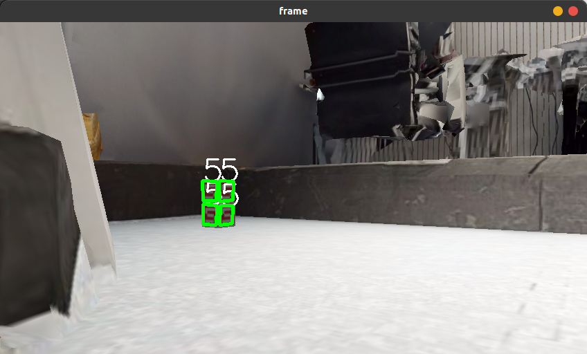
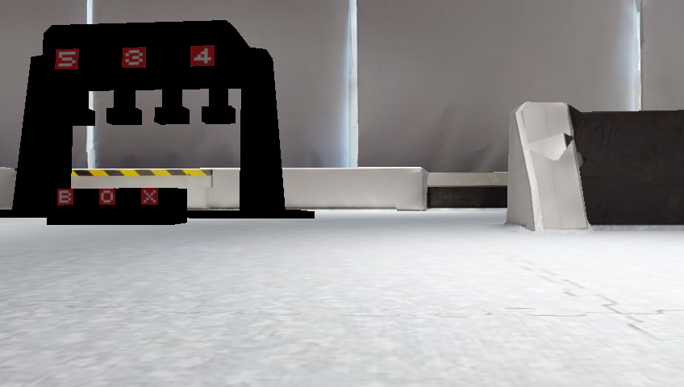
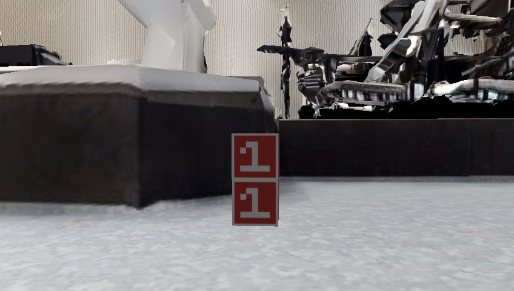
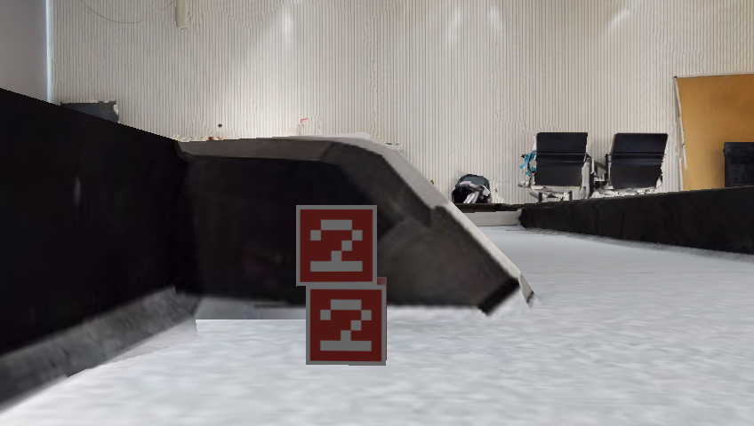
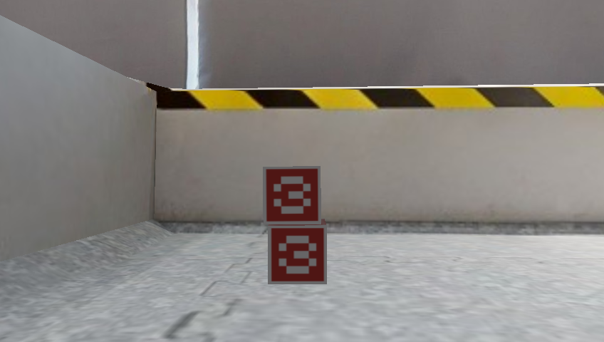
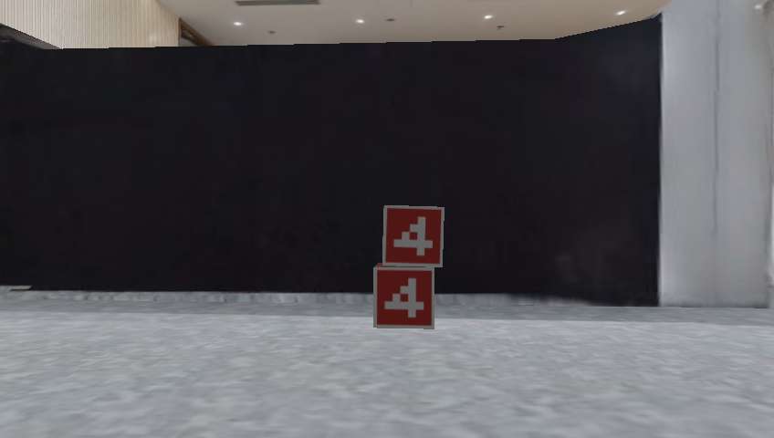
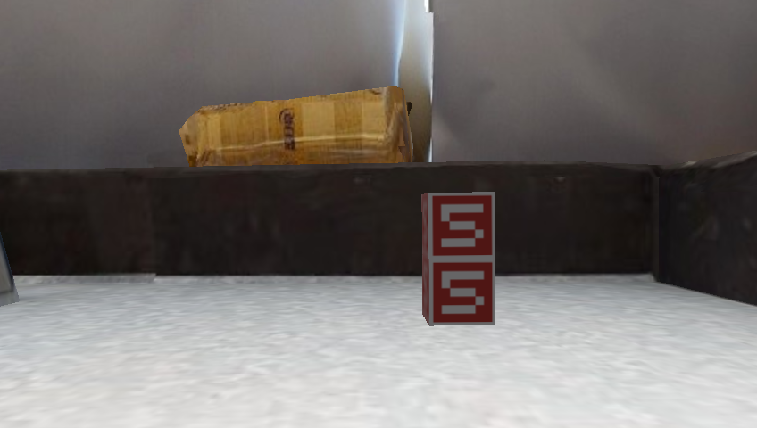
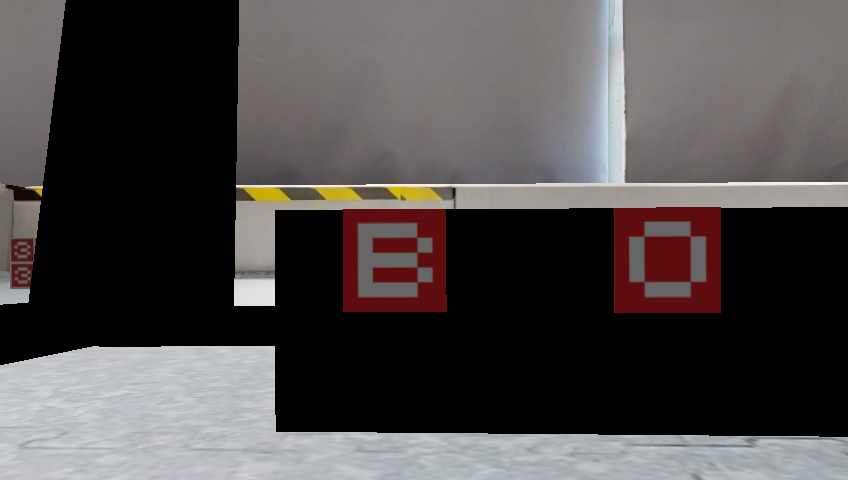
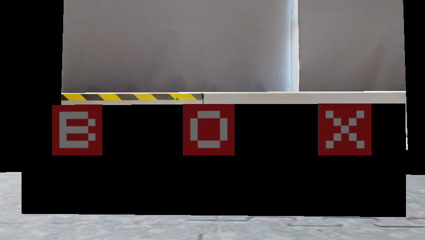
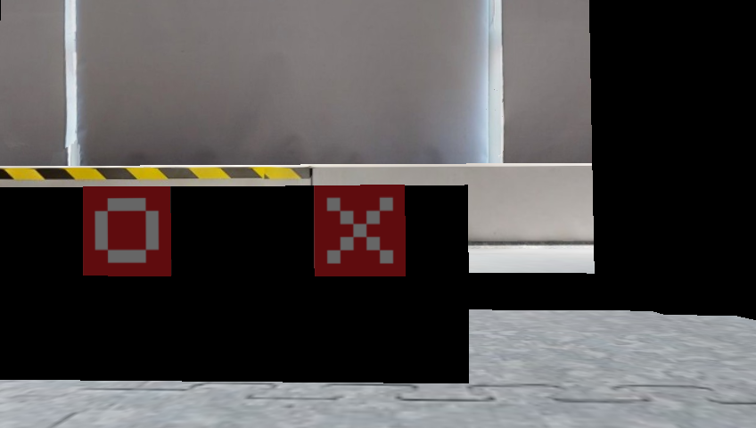

# BUCT 777

```sh
# Terminal 1
# Launch ROS
roscore
```

```sh
# Terminal 2
# Launch Habitat Simulation Platform
cd ICRA-RM-Sim2Real/docker_server
sudo docker start sim2real_server
./exec_server.sh
cd ~/ros_x_habitat_ws/src/ros_x_habitat/
python3 src/scripts/roam_with_joy.py --hab-env-config-path ./configs/roam_configs/pointnav_rgbd_roam_mp3d_test_scenes.yaml
```

```sh
# Terminal 3
# Launch ep_description
cd ICRA-RM-Sim2Real/docker_client
sudo docker start sim2real_client
./exec_client.sh
roslaunch ep_description ep_description.launch
```

## 1. Navigation

```sh
roslaunch buct_navigation navigation.launch
```

### 1.1 Odometry

The TF message between odom and base_link is published by **robot_localization**.</br>

There are three input sources of odometry:</br>

* laser_scan_matcher_odometry, which publishes /lsm_odom topic
* wheeled odom, which publishes /ep/odom topic
* IMU, which publishes /imu/data_raw topic

You can see the detailed configuration in **/buct_navigation/param/localization/odom_to_base.yaml**

### 1.2 Localization

I used **[iris_lama_ros](https://github.com/iris-ua/iris_lama_ros)** to localize the robot.</br>

The input laserscan data topic is /rplidar/scan.</br>

### 1.3 Planner

teb_local_planner</br>

You can see the detailed configuration in **/buct_navigation/param/teb**</br>


## 2. Marker Detect

***update***

```sh
rosrun buct_detect detect_cube.py
```

Message published in topic **/buct/target_list**





## 3. Multi Points (x,y,yaw_angle)

```sh
roslaunch buct_navigation multi_goals.launch
```

### 3.1 (0.0017, 0.9649, -0.6262)



### 3.2 (0.0966, 2.6168, 89.3320)



### 3.3 (0.3695, 2.7878, -87.1939)



### 3.4 (1.9732, 2.6603, -1.1807)



### 3.5 (2.3293, 0.1382, -179.7316)



### 3.6 (2.6125, -0.7969, -4.7499)



### 3.7 (1.1275, 1.8853, -1.2375)



### 3.8 (1.1211, 1.6779, -1.2644)



### 3.9 (1.1205, 1.5891, -1.1990)               不




## 4. SLAM

```sh
roslaunch buct_navigation slam.launch
```

Configuration files in **buct_navigation/param/cartographer**

## 5. Smach State Machine
### 5.1 Changes Statement:
adding files: 
```sh
smach_main.py
detect_cube.py
grasp_cube.py
place_cube.py
multi_go.py
navigaton_smach.launch
#backup the older version with _ 
```
updating package.xml&cmakelist

### 5.2 Run
```sh
sudo apt-get install ros-noetic-executive-smach
roslaunch buct_navigation navigation_smach.launch
``` 
### 5.3 Bugs
EP can't detect all the three numbers at the first step and grasping cube has a loooooooow success rate.

### 6 Bag
```sh
# Launch ep_description
cd ICRA-RM-Sim2Real/docker_client
sudo docker start sim2real_client
./exec_client.sh
roslaunch ep_description ep_description.launch
# Launch bag
roslaunch buct_navigation positioning_and_navigation_bag.launch
```
Be careful with "bag_filename"  in  positioning_and_navigation_bag.launch

